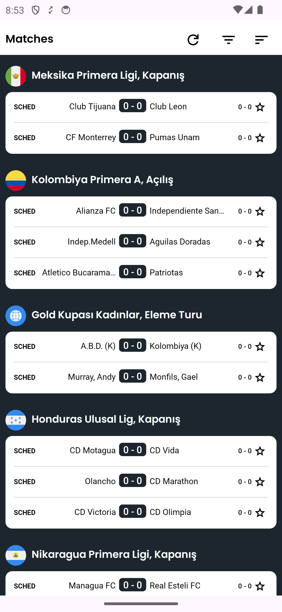
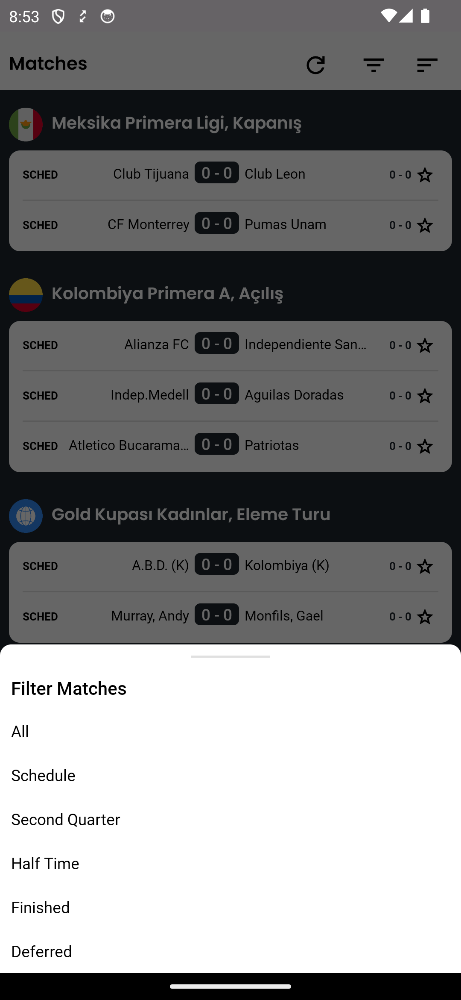
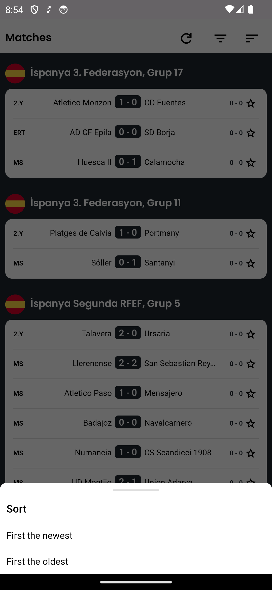
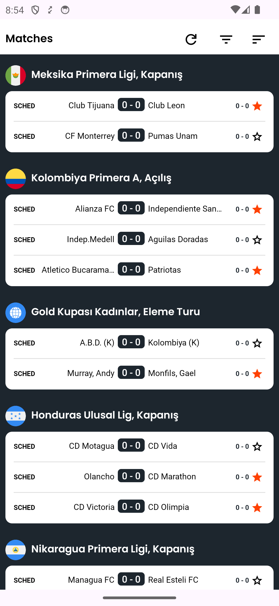
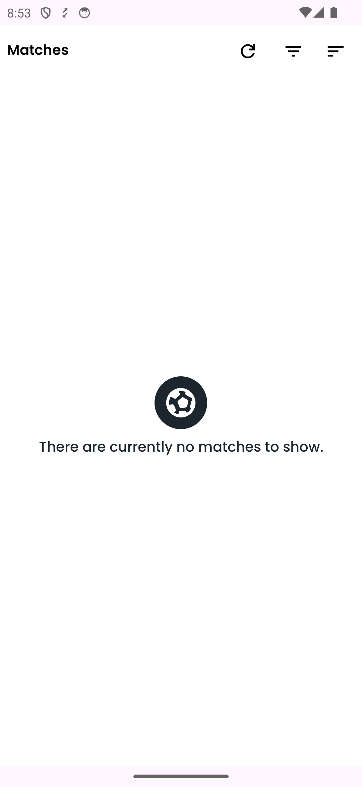
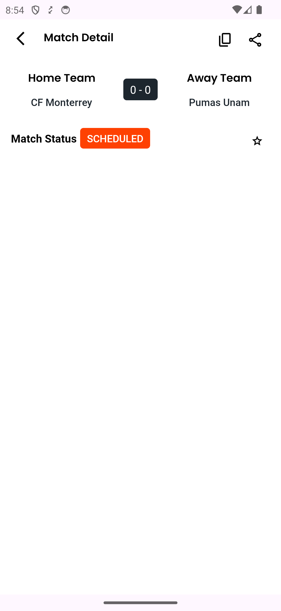

# Sanstech Assignment

This repository contains the Android application for Sanstech, designed to interact with a sports match API and display match details using a RecyclerView. It offers filtering capabilities based on match status and time.

## Screenshot

| Matches | Filter Match| Sort Match
| ----- | ----- | ----- |
||||

| Star Match | Empty Match| Match Detail
| ----- | ----- | ----- |
||||

## Video

https://github.com/eraybulut/sanstech-assignment/assets/84306596/f2378253-6b54-4dc6-95d2-7f5b077af805

## Project Structure

The project follows a clean architecture approach, organized into several packages:

- `base`: Contains base classes for common functionalities.
- `data`: Includes data handling, such as models, repositories, and services.
- `domain`: Holds use cases and business logic.
- `ui`: Consists of user interface components, organized by features such as match details and match list.
- `utils`: Provides utility classes and extensions.

## Branches

Development has been carried out using feature branches merged into the `development` branch:

- `features/matches-detail-ui-design`
- `features/matches-sort-by-date-bottom-sheet`
- `features/matches-filter-bottom-sheet`
- `features/matches-list-api-integration`
- `features/matches-list-ui-design`
- `features/base-classes`
- `features/navigation-and-fragments`
- `features/hilt-dependency-injection`
- `bugfix/network-and-error-handling`

Each feature branch is dedicated to a specific component or enhancement of the application.

## Gradle Configuration

The project uses Gradle for build configuration, with the following setup:

- **Namespace**: `com.eraybulut.sanstech_assignment`
- **Compile SDK**: 34
- **Min SDK**: 24
- **Target SDK**: 34
- **Version**: 1.0

## Dependencies

The application incorporates various libraries and plugins:

- **AndroidX Core & KTX**: Essential components for Android app development, offering backward-compatible versions of Android framework APIs and Kotlin extensions. [AndroidX Core](https://developer.android.com/jetpack/androidx/releases/core), [KTX](https://developer.android.com/kotlin/ktx).
- **AppCompat**: Provides access to the ActionBar and other app support features, making them backward-compatible. [AppCompat](https://developer.android.com/jetpack/androidx/releases/appcompat).
- **Material Components**: Implements Material Design components for a cohesive and visual aesthetic. [Material Components](https://material.io/develop/android/docs/getting-started).
- **ConstraintLayout**: Allows for complex and flexible layouts with a flat view hierarchy. [ConstraintLayout](https://developer.android.com/reference/androidx/constraintlayout/widget/ConstraintLayout).
- **Lifecycle Extensions & Runtime**: Manages UI-related data in a lifecycle-conscious way and simplifies the life cycle management. [Lifecycle Extensions](https://developer.android.com/jetpack/androidx/releases/lifecycle), [Runtime KTX](https://developer.android.com/kotlin/ktx#lifecycle).
- **Kotlin Coroutines**: Provides asynchronous programming support to run code sequentially. [Coroutines](https://kotlinlang.org/docs/coroutines-overview.html).
- **Lottie**: A library for Android that parses Adobe After Effects animations and renders them natively. [Lottie](https://airbnb.io/lottie/#/android).
- **Retrofit**: A type-safe HTTP client for Android and Java. [Retrofit](https://square.github.io/retrofit/).
- **Hilt**: A dependency injection library for Android that reduces the boilerplate of doing manual dependency injection in your project. [Hilt](https://dagger.dev/hilt/).
- **OkHttp Logging Interceptor**: Logs HTTP request and response data for debugging purposes. [OkHttp Logging Interceptor](https://square.github.io/okhttp/interceptors/).
- **Chucker**: An HTTP inspector for Android OkHttp clients. [Chucker](https://github.com/ChuckerTeam/chucker).
- **Fragment KTX**: Kotlin extensions for the `fragment` package, making it more idiomatic and pleasant to use. [Fragment KTX](https://developer.android.com/jetpack/androidx/releases/fragment).
- **Navigation Component**: Helps implement navigation from simple button clicks to more complex patterns. [Navigation Component](https://developer.android.com/guide/navigation/navigation-getting-started).
- **SwipeRefreshLayout**: Provides a swipe-to-refresh UI pattern. [SwipeRefreshLayout](https://developer.android.com/jetpack/androidx/releases/swiperefreshlayout).
- **Coil**: An image loading library for Android backed by Kotlin Coroutines. [Coil](https://coil-kt.github.io/coil/).

